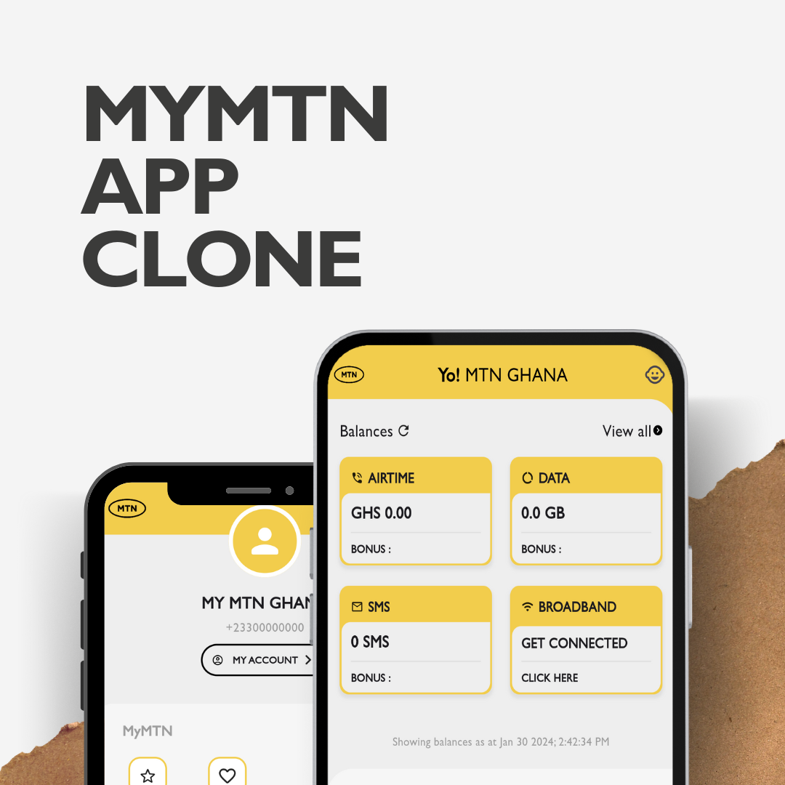

# MyMTN Clone - A Clone of the MTN Ghana App

**Note:** This is a clone of the MTN Ghana app's UI only and does not offer any official functionality.

## Overview

MyMTN is a clone of the official MTN Ghana app focusing solely on replicating the user interface. It allows you to explore the layout and design of the app without any functional features.

## Features

- **Cloned UI:** Explore the app's design and layout including sections like Momo, Account Balance, Shop etc.
- **Open Source:** Feel free to contribute to the project by forking the repository and making pull requests.

## Requirements

- This is a UI clone only and does not offer any functional features.
- No specific technical requirements are needed to run this project.

## Installation

1. Clone this repository:
   ```
   git clone https://github.com/EAshitey/my_mtn_app_clone.git
   ```
3. No further installation steps are required. You can freely explore the UI in the cloned directory.

## Contributing

We welcome contributions to this project! If you find any issues or have suggestions for improvement, please feel free to:

- Open an issue on the GitHub repository.
- Fork the repository and make a pull request with your changes.

Please follow the contribution guidelines outlined in the ```CONTRIBUTING.md``` file (if available).

## Disclaimer

This project is not affiliated with MTN Ghana in any way. It is solely a UI clone for educational and exploratory purposes. Please refer to the official MTN Ghana app for any official services and functionalities.

Tags

- mtn-ghana
- app-clone
- ui-design
- open-source
- contribution
